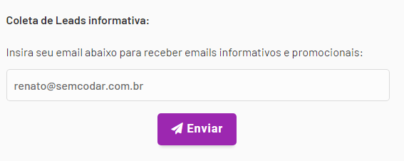
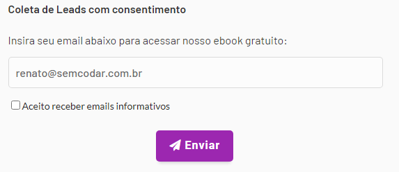
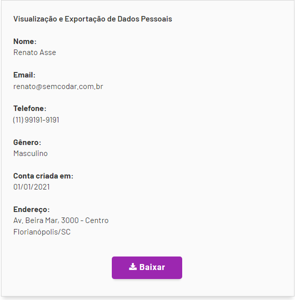

# Pesquisa LGPD

## **1. OBJETIVOS**

*Esta pesquisa tem como objetivo estudar a LGPD(lei geral de proteção de dados) para sites e aplicativos.*

---

* Adquirir conhecimentos em LGPD para sites 
* Adquirir conhecimentos em LGPD para aplicativos
* Adequar a empresa nos padrões LGPD

---

### **Adequação empresarial**

* O que é LGPD?
* Consequências da não adequação
* Modelo para sites e aplicativos
* Obrigações empresariais

## **2. DESENVOLVIMENTO**

Este documento será baseado principalmente no E-book "Guia prático LGPD para sites e aplicativos" elaborado por Renato Asse da comunidade Sem Codar e produzido por Start Comply(Escritório especializado em compliance LGPD).

### **1. O QUE É LGPD?**

A Lei Geral de Proteção de Dados (13.709/2018) tem como principal objetivo proteger os direitos fundamentais de liberdade e de privacidade e o livre desenvolvimento da personalidade da pessoa natural. Também tem como foco a criação de um cenário de segurança jurídica, com a padronização de regulamentos e práticas para promover a proteção aos dados pessoais de todo cidadão que esteja no Brasil, de acordo com os parâmetros internacionais existentes.

A lei define o que são dados pessoais e explica que alguns deles estão sujeitos a cuidados ainda mais específicos, como os dados pessoais sensíveis e dados pessoais sobre crianças e adolescentes. Esclarece ainda que todos os dados tratados, tanto no meio físico quanto no digital, estão sujeitos à regulação. Além disso, a LGPD estabelece que não importa se a sede de uma organização ou o centro de dados dela estão localizados no Brasil ou no exterior: se há o processamento de informações sobre pessoas, brasileiras ou não, que estão no território nacional, a LGPD deve ser observada. A lei autoriza também o compartilhamento de dados pessoais com organismos internacionais e com outros países, desde que observados os requisitos nela estabelecidos. 

### **2. PRIVACY BY DESIGN**

**Preventiva, não corretiva:**  Ter o consentimento do usuário antes de fazer determinada ação;  
**Funcionalidade completa:**  O aplicativo/site precisa funcionar normalmente caso o usuário recuse compartilhar seus dados;  
**Transparência:** Para que, qual e como será usado o dado coletado;  
**Privacidade como padrão:**  Caixas de seleção precisam estar desmarcadas;  

### **3. NÃO ADEQUAÇÃO A LGPD**

Multas e penalidades:  

1. Advertência. Essa advertência virá com um prazo para que a empresa se adeque à legislação. Se não se corrigir no prazo estipulado, haverá penalidade.

2. Multa simples em cima do faturamento. Essa multa pode ser de até 2% do faturamento anual da pessoa jurídica ou até mesmo suspensão das atividades. O limite é de 50 milhões de reais por infração.  
A definição sobre as multas por não adequação foi feita ainda em 2018, no entanto, só serão oficialmente aplicadas em 2023. Isto porque a dosimetria das infrações terá definição em janeiro e com ela será possível analisar os casos e entender qual tratativa dar para cada um deles.

3. Multa diária. Essa multa também será limitada a 50 milhões de reais.

4. Publicização da infração. A infração se tornará pública e os prejuízos à imagem da empresa poderão ser enormes.

5. Bloqueio dos dados pessoais. Essa sanção administrativa impede que as empresas utilizem os dados pessoais coletados até a situação se regularizar.

6. Eliminação dos dados pessoais. A sexta penalidade prevista na LGPD obriga a empresa a eliminar por completo os dados coletados em seus serviços, causando danos à operação da empresa.  

### **4. REGRAS**

**Política de privacidade**  

 É obrigatório e tem como objetivo explicitar informações como, lista de dados do usuário, o que será feito com aqueles dados e porque é necessário a coleta desses dados. 

**Coleta de LEADS** 

Leads é a captura do e-mail do usuário com a finalidade de enviar e-mails do próprio interesse da empresa
1. Informativo:  

2. Consentimento:  

**Cadastro de usuário**  

É importante coletar o mínimo de dados possível e sempre deixar claro para o usuário porque você precisa daquele dado.  
**Redefinição de senha:** padrão 2 fatores;  
**Boa prática:** força de senha e tempo de alteração de senha;  
**Vizualização e exportação de dados:** o usuário precisa de uma página onde ele possa visualizar e exportar seus dados;  

**Eliminação de dados:**  o usuário pode a qualquer momento solicitar a eliminação de dados, porém, a empresa não pode apagá-los do sistema. Esse processo é válido de 5 á 10 anos (talvez necessário consulta judicial), prazo legislativo para armazenamento de dados. Depois do prazo estabelecido, os dados poderão ser deletados ou anonimizados;

**Pagamentos:**  deixar claro ao usuário que seus dados bancários não serão armazenados pela empresa, mas sim pelo meio de Gateway de pagamento, a única informação da empresa será a de status de transação;

**Cookies:**  a barra deve informar ao usuário sobre a coleta de dados, ter o link da política de privacidade e os botões "Aceitar" e "Recusar", com mesa fonte, cor e tamanho, sem qualquer distinção. Não coletar os dados enquanto o usuário não clicar em aceitar;  

**Regras de privacidade:** informação sobre quais dados os usuários terão acesso;  

### **5. Encarregados de dados (DPO)**

Pela LGPD, a indicação do Encarregado – DPO (Data Protection Officer) é obrigatório para todas as empresas, independentes do porte, atividade econômica ou volume de tratamento.  
Exceções (segundo o site [Data Guide](https://dataguide.com.br/quando-e-obrigatorio-dpo/)):

>Considera-se Startup: (I) as empresas com até 10 anos de inscrição no cadastro nacional de pessoa jurídica (CNPJ); (II) com faturamento bruto anual máximo de R$ 16 milhões; e (III) que utilizem modelos de negócios inovadores para geração de produtos ou serviços.
Definição baseada no Marco Legal das Startups.  
>Considera-se empresa de pequeno porte: entidade com faturamento anual de até R$ 4,8 milhões e até 99 funcionários.   
>Considera-se microempresa: entidade com faturamento anual de até R$ 360 mil e 19 funcionários, sendo que o microempreendedor individual poderá ter faturamento anual máximo de R$ 81 mil e 1 funcionário.
Definição baseada no Estatuto Nacional da Microempresa e da Empresa de Pequeno Porte.

Contudo, se sua empresa é de pequeno porte ou uma startup, por exemplo, mas preenche algum dos critérios abaixo, você possui a obrigação legal de indicar um DPO:

>Realiza tratamento de dados de alto risco para os titulares, conforme os critérios que serão expostos no próximo tópico;   
Obtêm receita bruta superior aos limites de faturamento estipulados pelo Marco Legal das Startups e Estatuto Nacional da Microempresa e da Empresa de Pequeno Porte, mencionados anteriormente;   
Pertence a um grupo econômico de fato ou de direito, cuja receita global ultrapassa os limites de faturamento também mencionados anteriormente. 

* O que é considerado um “tratamento de alto risco”?   

Será considerado de alto risco o tratamento de dados pessoais que atender cumulativamente a pelo menos um critério geral e um critério específico.  

Critérios específicos:  
a) Uso de tecnologias emergentes ou inovadoras:  
>AR/VR, Inteligência Artificial, Drones, Blockchain e Criptomoedas, IoT, Cleantechs e SmartCities, IoT e Big Data e Analytics.

d) utilização de dados pessoais sensíveis ou de dados pessoais de crianças, de adolescentes e de idosos.

## **CONCLUSÃO/CONSIDERAÇÕES FINAIS**

É de extrema importância adequar o layout do seu site ás normas da LGPD, que entrou em vigor em território nacional no dia 16 de agosto de 2020.   
Existem alguns sites que podem ajudar a gerar documentos como a [Iubenda](https://www.iubenda.com/pt-br/), que gera política de privacidade, cookies, termos e condições, consent solution e internal privacy management, [Gerador Zyro](https://zyro.com/br/ferramentas/gerador-de-termos-de-uso) e [Gerador Nuvemshop](https://www.nuvemshop.com.br/ferramentas/gerador-termos-de-uso).  

Uma consideração importante é que se a empresa precisar coletar dados peculiares ou sair desse padrão proposto, é necessário uma consultoria jurídica para auxiliar no processo.

Apesar da LGPD estar em vigor desde 2020, o ano de 2022 foi marcado por vazamento do cadastro de pessoas físicas e exposição de brasileiros a golpes de phishing. Para se ter uma ideia, o Brasil foi o quarto país com maior número de usuários que tiveram informações pessoais violadas no mundo no segundo trimestre de 2022, de acordo com um estudo global produzido pela empresa de segurança cibernética Surfshark.

## **REFERÊNCIA BIBLIOGRÁFICA**

* MPF: <https://www.mpf.mp.br/servicos/lgpd/o-que-e-a-lgpd>

* Goadopt: <https://goadopt.io/blog/multas-na-lgpd/>

* Site modelo LGPD: <https://semcodar-lgpd.bubbleapps.io/>

* LGPD Brasil: <https://www.lgpdbrasil.com.br/lgpd-em-2023-expectativa-e-previsoes/#:~:text=Crescimento%20da%20atua%C3%A7%C3%A3o%20de%20encarregados,levar%C3%A1%20ao%20aumento%20da%20atua%C3%A7%C3%A3o.>  

* JusBrasil: <https://mayaranoveleto.jusbrasil.com.br/artigos/1235359246/o-papel-do-encarregado-dpo-e-sua-obrigatoriedade#:~:text=Pela%20LGPD%2C%20a%20indica%C3%A7%C3%A3o%20do,econ%C3%B4mica%20ou%20volume%20de%20tratamento.>

* Data Guide: <https://dataguide.com.br/quando-e-obrigatorio-dpo/>

* Jornal contábil: <https://www.jornalcontabil.com.br/lgpd-o-que-eu-devo-saber-para-2023/>